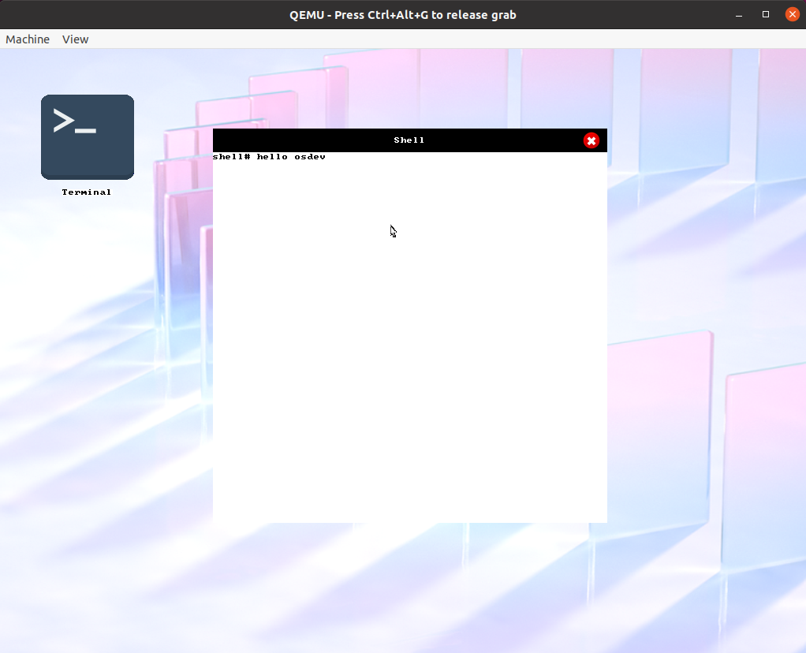
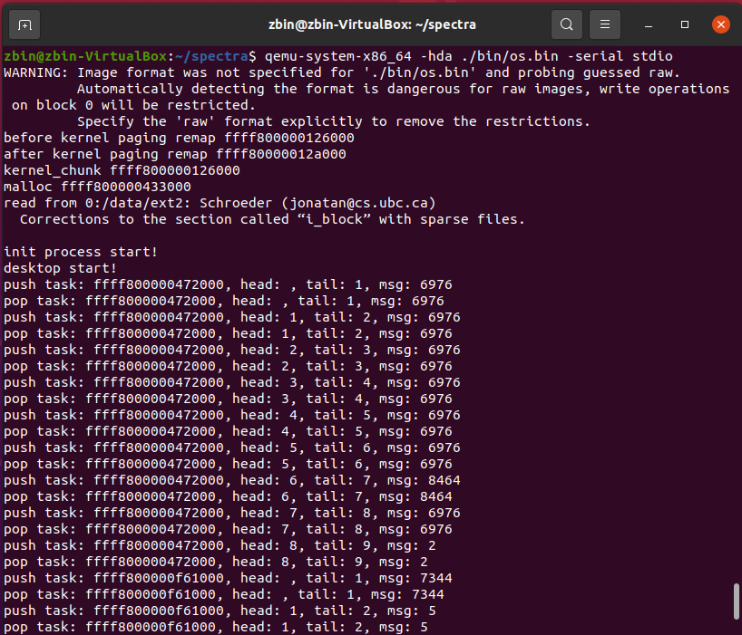

# spectra

<p>A 64bit operating system kernel with graphical user interface.</p>




## Documentation
TODO

## How to create a app
Here is a demo to create a `500 x 500` gui window with a control panel, and show how to handle the user event.

```c
#include "stdio.h"
#include "unistd.h"
#include "stdlib.h"
#include "string.h"
#include "gui/gui.h"
#include "gui/label.h"
#include "window/window.h"
#include "messages.h"
#include "assets/color.h"

int main(int argc, char** argv)
{
    uint32_t width = 500;
    uint32_t height = 500;
    int32_t x = 150;
    int32_t y = 100;
    int id = 1;
    const char* title = "demo";
    demo_win = create_gui_window(0, width, height, x, y, 0, id, title, 0, 0);
    if (!demo_win)
    {
        printf("create window fail!\n");
        return 0;
    }
    create_window_control_panel(demo_win, 2);

    struct message* msg = (struct message*)malloc(sizeof(struct message));
    char ch;

    while (1)
    {
        window_get_message(shell_win, msg);
        switch (msg->event)
        {
        case MESSAGE_KEY_PRESS:
            ch = (char)msg->key;
            // handle keyboard
        default:
            window_consume(shell_win, msg);
            break;
        }
        if (demo_win->state == WINDOW_CLOSE) break;
    }
    // ...
    return 0;
}
```


## :heavy_check_mark: TODO

### Kernal
- [✔] Filesystem

- [✔] Ext2 Read/Stat/Close/Seek

- [✔] Process/Multitasking
    - [✔] execve/fork
    - [✔] exit
    - [✔] wait/waitpid
    - [✔] schedule
    - [✔] sleep/wake_up

- [✔] PS2 Keyboard

- [✔] Mouse Driver

- [✔] Message Queue handle Events

- [✔] Graphical User Interface
    - [✔] VESA
    - [✔] Font 8X8
    - [✔] Standard library
    - [✔] Implement window/button/label
    - [✔] Implement event bubbling
    - [✔] Support img UI element

- [✔] TGA image file support

Programs
- [✔] Desktop
- [✔] Shell


