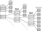

# Reference

## Boot
[How Computers Boot Up](https://manybutfinite.com/post/how-computers-boot-up/)

[Rolling Your Own Bootloader](https://wiki.osdev.org/Rolling_Your_Own_Bootloader)

#### Multiboot

[Multiboot](https://wiki.osdev.org/Multiboot)

[GRUB](https://wiki.osdev.org/GRUB)

## Kernel
[JamesM's kernel development tutorials](http://www.jamesmolloy.co.uk/tutorial_html/index.html)

[Creating a 64bit Kernel](https://wiki.osdev.org/Creating_a_64-bit_kernel)

[Real Mode](https://wiki.osdev.org/Real_Mode)

[Protected Mode](https://wiki.osdev.org/Protected_Mode)

[Long Mode](https://wiki.osdev.org/Setting_Up_Long_Mode)

[Entering Long Mode Directly](https://wiki.osdev.org/Entering_Long_Mode_Directly)

[Entering Long Mode](https://os.phil-opp.com/entering-longmode/)

[CPU Registers](https://wiki.osdev.org/CPU_Registers_x86-64#RFLAGS_Register)

## Paging
[Paging](https://wiki.osdev.org/Paging)

[Page Table](https://wiki.osdev.org/Page_Tables)

[Setting Up Paging](https://wiki.osdev.org/Setting_Up_Paging)

## Heap
[Heap](https://wiki.osdev.org/Heap)

[SimpleHeapImplementation](https://wiki.osdev.org/User:Pancakes/SimpleHeapImplementation)

[Bitmap Based](https://wiki.osdev.org/User:Pancakes/BitmapHeapImplementation)

[Linked List Bucket Heap](https://wiki.osdev.org/User:Mrvn/LinkedListBucketHeapImplementation)

[Writing a MM](https://wiki.osdev.org/Writing_a_memory_manager)

## User land
[Geting to Ring 3](https://wiki.osdev.org/Getting_to_Ring_3)

[Operating Systems Development - User land](http://www.brokenthorn.com/Resources/OSDev23.html)

[Task State Segment](https://wiki.osdev.org/Task_State_Segment)

[Tss Struct](https://www.sandpile.org/x86/tss.htm)

## Filesystem
[Ext2](https://wiki.osdev.org/Ext2)

[The Second Extended File System](https://www.nongnu.org/ext2-doc/ext2.html)

[The Ext2 Filesystem](http://www.science.smith.edu/~nhowe/262/oldlabs/ext2.html)

[Making A GRUB2 image with Ext2](./Making_a_GRUB2_image.md)

## GDT
[Global Descriptor Table](https://wiki.osdev.org/Global_Descriptor_Table)

[GDT Tutorial](https://wiki.osdev.org/GDT_Tutorial)

## multitask
[PIT](https://wiki.osdev.org/Programmable_Interval_Timer)

[Brendan%27s_Multi-tasking_Tutorial](https://wiki.osdev.org/Brendan%27s_Multi-tasking_Tutorial)

## Keyboard

[PS2 Keyboard](https://wiki.osdev.org/PS/2_Keyboard)

## Font
[VGA Fonts](https://wiki.osdev.org/VGA_Fonts)

[PC Screen Font](https://wiki.osdev.org/PC_Screen_Font)

[solarize psf](https://github.com/talamus/solarize-12x29-psf)

[Scalable_Screen_Font](https://wiki.osdev.org/Scalable_Screen_Font)

[VESA](https://wiki.osdev.org/VESA)

## VGA
[VGA Hardware](https://wiki.osdev.org/VGA_Hardware)

[Drawing In Protected Mode](https://wiki.osdev.org/Drawing_In_Protected_Mode)

[GUI](https://wiki.osdev.org/GUI)

[Double Buffering](https://wiki.osdev.org/Double_Buffering)

[VESA Tutorial](https://wiki.osdev.org/User:Omarrx024/VESA_Tutorial)

[VESA Video Modes](https://wiki.osdev.org/VESA_Video_Modes)

[vbe20](http://www.phatcode.net/res/221/files/vbe20.pdf)

[Loading Icons](https://wiki.osdev.org/Loading_Icons)

[Multiboot2 Graphics OS with GRUB2](https://forum.osdev.org/viewtopic.php?f=1&t=39370)

[OSDevVid2](http://www.brokenthorn.com/Resources/OSDevVid2.html)

## PS2 Mouse
[Mouse Input](https://wiki.osdev.org/Mouse_Input)

[PS/2_Mouse](https://wiki.osdev.org/PS/2_Mouse)

[Free PS/2 mouse code](https://forum.osdev.org/viewtopic.php?f=1&t=10247)

## ELF
[Executable_and_Linkable_Format](https://en.wikipedia.org/wiki/Executable_and_Linkable_Format)
[ELF Struct](https://wiki.osdev.org/ELF)
[ELF_Tutorial](https://wiki.osdev.org/ELF_Tutorial)
[ElfLoading Demo](https://wiki.osdev.org/User:Joeeagar/ElfLoading)
[ELF introduction](https://www.baeldung.com/linux/executable-and-linkable-format-file)